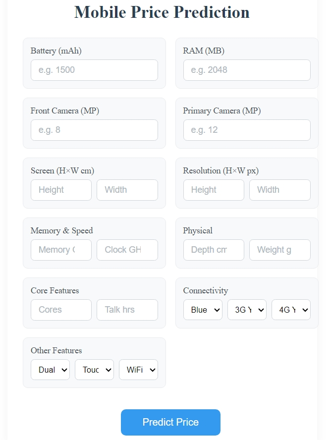
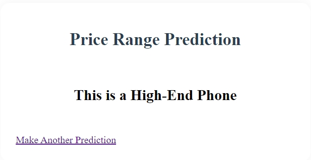

# 📱 Mobile Price Range Predictor

A intelligent web application that predicts mobile phone price ranges using machine learning. Built with Flask and scikit-learn, this project helps users understand which price category a phone might fall into based on its specifications.

## 📸 App Screenshots

<p float="left">
  
  
</p>

*Left: Input form for specifications | Right: Prediction result*

## ✨ Features

- **Smart Prediction**: Uses Support Vector Machine (SVM) algorithm to predict price ranges
- **User-friendly Interface**: Clean and intuitive design for easy input
- **Real-time Results**: Instant predictions in four price categories
- **20+ Parameters**: Comprehensive analysis using various phone specifications

## 🎯 Price Categories

- **Budget Phone**: Entry-level phones with basic features
- **Mid-Range Phone**: Balanced performance and features
- **Premium Phone**: High-performance devices with advanced features
- **High-End Phone**: Top-tier flagship devices with cutting-edge specifications

## 🛠️ Tech Stack

- **Frontend**: HTML, CSS
- **Backend**: Flask (Python)
- **ML Model**: scikit-learn (SVM)
- **Data Processing**: pandas, numpy

## 🚀 Getting Started

1. **Clone the repository**
   ```bash
   git clone https://github.com/Amitjangir010/Mobile_phone_price_range_prediction_model.git
   cd Mobile_phone_price_range_prediction_model
   ```

2. **Set up virtual environment**
   ```bash
   python -m venv venv
   
   # Windows
   venv\Scripts\activate
   
   # Linux/Mac
   source venv/bin/activate
   ```

3. **Install dependencies**
   ```bash
   pip install -r requirements.txt
   ```

4. **Train the model**
   ```bash
   python model/train.py
   ```

5. **Run the application**
   ```bash
   python app.py
   ```

6. **Open in browser**
   ```
   http://127.0.0.1:5000
   ```

## 📊 Input Parameters

### Basic Specifications
- Battery Power (mAh)
- RAM (MB)
- Internal Memory (GB)
- Clock Speed (GHz)

### Camera Features
- Primary Camera (MP)
- Front Camera (MP)

### Display
- Screen Dimensions (cm)
- Resolution (pixels)
- Touch Screen

### Physical Attributes
- Device Weight (g)
- Device Depth (cm)

### Connectivity
- Bluetooth
- 3G
- 4G
- WiFi
- Dual SIM

### Performance
- Number of Cores
- Talk Time (hours)

## 🎯 Model Performance

- Algorithm: Support Vector Machine (SVM)
- Kernel: Linear
- Accuracy: ~98%
- Training Data: 2000 mobile devices

## 💡 Use Cases

- **Consumers**: Understanding fair price ranges for desired specifications
- **Retailers**: Quick price range estimation for new models
- **Manufacturers**: Market positioning analysis
- **Market Analysis**: Understanding price-feature relationships

## 🙏 Acknowledgments

- Dataset inspired by real-world mobile phone specifications
- UI design influenced by modern web design principles
- Special thanks to all contributors and the open-source community

---
Made with ❤️ by Amit Jangir 